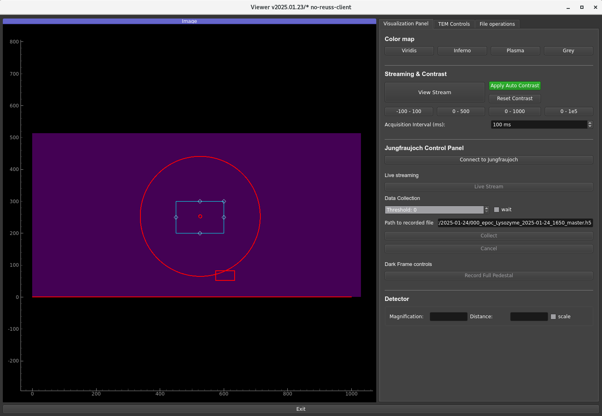
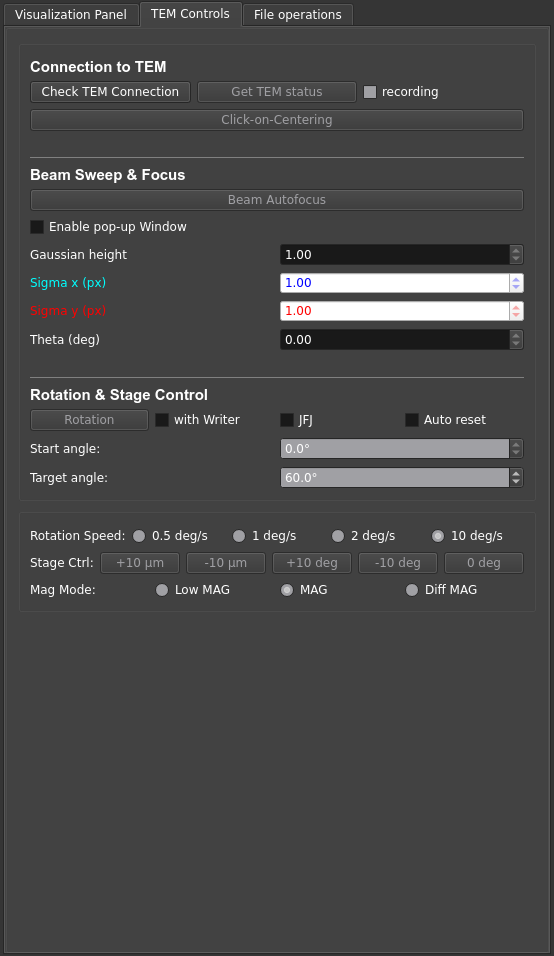
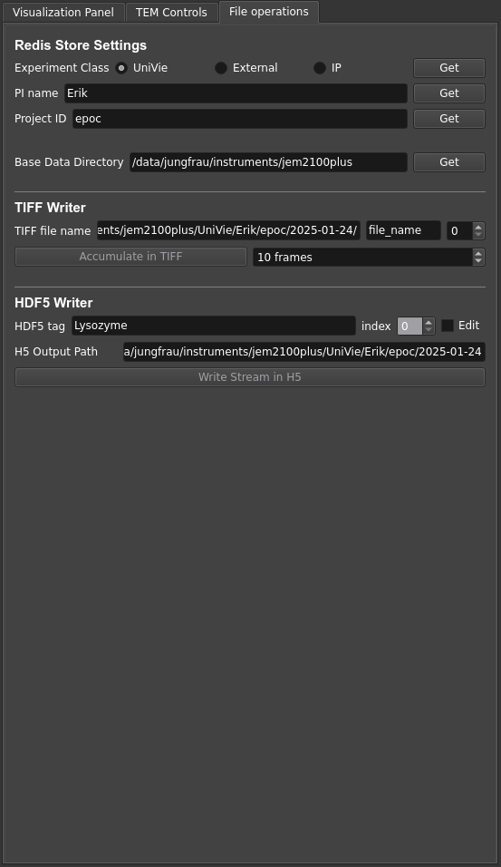

====================
Jungfrau GUI
====================

.. note::

    This page summarizes the main functionalities of the GUI. Each sections gives a brief overview of the avalable buttons/fileds and their functionality in each respective tab of the user interface.  

Visualization Panel
"""""""""""""""""""""""

Below is a screenshot of the Image area (left) and the Visualization Panel tab (right):

A. **Color map**
----------------

In this section, the user can define the colormap to map scalar data values to colors. Available options are:

- Viridis
- Inferno
- Plasma
- Grey

B. Streaming & Contrast
-----------------------

**[View Stream]**
   Intercepts and decodes the ZeroMQ stream of frames published by the Jungfraujoch receiver.

**Apply Auto Contrast**
   Dynamically adjusts the contrast of displayed frames. 
   
   .. tip:: 
    
        The algorthim retains values only between the 1st and the 99th percentile of the value range. One advantage is to throw out any non-physical outlier values such as overflows.

**Reset Contrast**
   Turn off the auto-contrast and reload preset contrast values from Redis. Four other presets can also be used.

**Acquisition Interval (ms)**
   Defines the interval between each two displayed frames i.e. the display frame rate.

C. **Jungfraujoch Control Panel**
---------------------------------

**Connect to Jungfraujoch**
    Establishes a connection with the Jungfraujoch receiver.

**Live stream**
    Displays summed frames.

    .. tip:: 
    
        A default setting of the GUI is to limit the live stream to 72000 frames at a time i.e. roughly 1h of data for a 20Hz frame rate. 
        The reason to have a limit is that Jungfraujoch (the data backend) allocates buffers depending on the amount of frames it expects to collect. Setting a much larger number will make the start and stop slower. 

**Threshold**
    Defines the energy in keV below which values are cut.

    .. tip:: 
        In the Jungfraujch, thresholding is enabled when the entered value **th** is positive i.e. 

        - **th = 0** : Thresholding is disabled
        - **th > 0** : Pixel values below **th** are reset to zero.

**wait**
    If checked, this option freezes the GUI during data collection.

**Collect**
    Starts the recording of streamed frames.

**Cancel**
    Ends data collection.

**Record Full Pedestal**
    Records and subtracts the dark frames. Temporarily gets unresponsive to any controls (several seconds). Pedestal data is saved in the Jungfraujoch (not in GUI).
    
D. **Detector**
----------------

**Magnification, Distance**: 
    Read-only fields that respectively the magnification and the distance values (TEM mode only). 

**scale**
    Checkbox that displays the scale bar (1 um) or the ring (1 A).

TEM Controls
"""""""""""""""""""""""

A. **Connection to TEM**
------------------------

**Check TEM Connection**

**Get TEM status**

    .. tip::
        **recording**

**Click-on-Centering**

B. **Beam Sweep & Focus**
-------------------------

**Beam Autofocus**

    .. tip::
        Detail all the fields

C. **Rotation & Stage Control**
-------------------------------

**[Rotation]**

    .. tip::
        Detail all the fields

**Start angle**

**Target angle**

**Rotation Speed**

**Stage Ctrl**

**Mag Mode**

File Operations
"""""""""""""""""""""""

