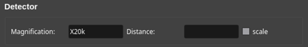
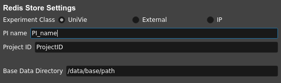
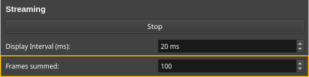
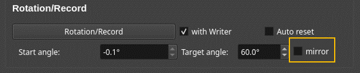

====================
Jungfrau GUI
====================

.. note::

    This page summarizes the main functionalities of the GUI. Each sections gives a brief overview of the avalable buttons/fileds and their functionality in each respective tab of the user interface.  

.. note::

    This document describes features of the release-v2025.04.23 version.
    
Below is a screenshot of the Image area (left) and the functionalities tabs (right):

**Main Area**
"""""""""""""""""""""""

**A. Dock Area**

- The main widget of the UI is a dock area of the ``pyqtgraph`` module.
- It displays an area of 1064 pixel rows and 1030 pixel columns for the 1 megapixel (1M) version of the JUNGFRAU.
- Frames being received by the ZeroMQ socket are decoded using ``cbor2``, reshaped into a 1030x1064 array of ``int32`` and then displayed on the image area.

**B. Contrast Controls**

``Apply Auto Contrast``
    Dynamically computes the lower (1st percentile) and upper (99th percentile) values of the image and accordingly updates the bounds of the histogram. Also throws out any non-physical outlier values such as overflows or NaNs.

``Reset Contrast``
    Turns off the auto-contrast and reloads preset contrast values from the Redis database.

``[-50 - 50]``, ``[0 - 100]``, ``[0 - 1000]``, ``[0 - 1e5]`` and ``[0 - 1e7]``
    Shortcut click buttons to try different contrasts for a better visualization under different conditions.

**Visualization Panel**
"""""""""""""""""""""""

**A. Color map**

.. image:: images/jf_gui_visualization_panel_1.png
   :alt: Screenshot of the Color map section
   :width: 380px
   :align: center

In this section, the user can define the colormap to map scalar data values to colors. Available options are:

- ``Viridis``
- ``Inferno``
- ``Plasma``
- ``Grey``

**B. Streaming**

.. image:: images/jf_gui_visualization_panel_2.png
   :alt: Screenshot of the Streaming & Contrast section
   :width: 380px
   :align: center

``View Stream``
   Starts the stream of frames after properly decoding the ZeroMQ stream of frames published by the Jungfraujoch receiver.

``Display Interval (ms)``
   Defines the interval between each two displayed frames i.e. the frame display rate of the UI.

**C. Jungfraujoch Control Panel**

.. image:: images/jf_gui_visualization_panel_3.png
   :alt: Screenshot of the Jungfraujoch Control Panel section
   :width: 380px
   :align: center

``Connect to Jungfraujoch``
    Displays the connection state between the UI and the Jungfraujoch back-end. Possible states are, hopefully, self-explanatory and include: ``Disconnected``, ``Communication OK``, ``Connection Timed Out`` and ``Connection Failed``.

``Live stream``
    Displays the state of the Live stream. Possible states are: ``Unknown``, ``Live stream of frames is ON`` and ``Live stream has been stopped``.

    .. tip:: 
    
        A default setting of the GUI is to limit the live stream to 72000 frames at a time i.e. roughly 1h of data for a 20Hz frame rate. 
        The reason to have a limit is that Jungfraujoch (the data back-end) allocates buffers depending on the amount of frames it expects to collect. Setting a much larger number will make the start and stop slower. 

``Threshold``
    Defines the energy in keV below which values are cut. This cut is done before the frame summation on the FPGA card.

    .. tip:: 
        In the Jungfraujoch, thresholding is enabled when the entered value ``th`` is positive i.e. 

        - ``th = 0`` : Thresholding is disabled
        - ``th > 0`` : Pixel values below ``th`` are reset to zero.

``wait on stream``
    If checked, this option freezes the GUI during live stream and data collection.

``Collect``
    Starts the recording of streamed frames. Files are saved as HDF5 files with comprehensive metadata (See :ref:`jungfraujoch` page)

``Cancel``
    Ends any ongoing measurement of the Junfraujoch (live streaming, data collection...)

``Record Full Pedestal``
    Records and subtracts the dark frames.

    .. tip::
        In order to prevent any user-initiated interruptions, the pedestal substraction has been made a blocking operation which temporarily makes the UI unresponsive to any controls.
        Pedestal data is saved in the Jungfraujoch usually running on a server machine.
    
**D. Detector**

``Magnification``, ``Distance``: 
    Read-only fields that respectively display the magnification (Imaging Mode) and the distance (Diffraction Mode) values for TEM mode only. 

``scale``
    Checkbox that displays the scale bar (1 μm) or the ring (1 Å).

**TEM Controls**
""""""""""""""""

**A. Connection to TEM**

``Check TEM Connection``
    Starts communication with TEM.

``Polling Freq``
    Editable field that allows the user to tune the frequency of the live queries that the GUI sends to the TEM API.

``Click-on-Centering``
    Activates stage control by clicking the image.
    The clicked-on point is moved to fit at the center of detector (MAG mode) or at the center of rectangular overlay (LowMAG mode). The function is disabled in DIFF-mode.

**B. Beam Sweep & Focus**

.. figure:: images/jf_gui_tem_controls_2.png
   :alt: Screenshot of the Beam Sweep & Focus section
   :width: 380px
   :align: center

``Accelerating potential (HT)``
    Voltage used to accelerate electrons.

``Gaussian Fit``
    Fits a function, typically a variant of a 2D-Gaussian, to the projected electron beam. Can be used to determine the beam center and assess the beam focus.

``Enable pop-up Window``
    If checked, creates a pop-up window displaying curves of evolution of fitted parameters of the on-live Gaussian fitting.

``X_center (px)``
    Abscissa of the Gaussian center in the coordinate system of the dock area.

``Y_center (px)``
    Ordinate of the Gaussian center in the coordinate system of the dock area.

``Sigma x (px)``
    Length of the major (longer) axis of the fitted ellipse (representing the 2D Gaussian).

``Sigma y (px)``
    Length of the minor (shorter) axis of the fitted ellipse.

**C. Rotation/Record & Stage Control**

.. figure:: images/jf_gui_tem_controls_3.png
   :alt: Screenshot of the Rotation & Stage Control section
   :width: 380px
   :align: center

``Rotation/Record``
    Starts stage rotation to the target angle. The beam is unblanked during rotation and blanked when rotation ends.
    
    - ``with Writer``: Synchronizes the HDF5 writer with rotation for ED data collection.
    - ``Auto reset``: Resets the tilt to 0 degrees after rotation ends [**This operation sets rotation speed to** ``10 deg/s``.]
    - ``Start angle``: Read-only field diplaying the current angle value (deg)
    - ``Target angle``: Editable fied to set end angle value (deg) of rotation.

``Rotation Speed``
    Sets the rotation velocity before starting the rotation. Also updates the ``rotation_speed_idx`` variable of the Configuration Manager in the data base.
    Options are ``0.5``, ``1``, ``2`` and ``10 deg/s``. 

``Fast movement``
    Commands fast relative movements (±10 µm) and rotation (±10°) of the stage. 

``Magnification Mode``
    Switches and displays (on the terminal) the current magnification mode.

    .. tip::
        In the PyJEM API, TEM modes are encoded as integers: 

        - **0=MAG**     : High magnification mode
        - **2=Low MAG** : Low magnification mode
        - **4=DIFF**    : Diffraction mode (Disables auto-contrast)

        More details on the PyJEM page: https://pyjem.github.io/PyJEM/interface/

``Blank/Unblanck beam``
    Toggle button that blanks or unblanks the electron beam.

``Positions``
    Dropdown menu to set the X-Y positions of the stage

    - ``Add``: Enquires about TEM stage position (through the API) and saves the coordinates in the dropdown menu
    - ``Go`` : Moves the TEM stage to the X-Y coordinates set in the ``Positions`` menu

**File Operations**
"""""""""""""""""""

**A. Redis Store Settings**

``Experiment Class``
    Specifies for whom the data is collected (e.g., ``UniVie``, ``External``, ``IP``).

``User Name*``
    Enter the PI (Person of Interest).

``Project ID*``
    Enter the project identifier.

``Base Data Directory``
    Specifies the root directory for data saving.

.. note::

    - All the fields marked with an asterisk (*) are manually editable. 
    - During edition, the entered values/text will be displayed in orange. 
    - Press [``ENTER``] to confirm modifications and values will be uploaded to the data base.

**B. HDF5 Output**

.. image:: images/jf_gui_file_operations_2.png
   :alt: Screenshot of the HDF5 Writer section
   :width: 380px
   :align: center

``HDF5 Tag*``
    Enter the file prefix (ASCII characters and underscores only).

``index*``
    Set the file index for the HDF5 file. Incrementation is automatic but can be edited by checking the ``Edit`` checkbox.

``H5 Output Path``
    Read-only field showing the path where datasets are saved on the server.

**C. Snapshot Writer**

``Snapshot file prefix*``
    Enter the file prefix for the HDF5 file of the snapshot.

``index*``
    Set the file index for the file. Reflects the same state as the ``index`` spinbox of the **HDF5 Output** section.

``Write Stream as a snapshot-H5``
    Stars the HDF5 writing of the snapshot. The snapshot triggers the JFJ data collection for a user-specified time lapse that is set to 1 second (1000 msec) by default.

**D. Result of Processing**

``XDS``
    Dislays the state of the XDS post-processing of the collected data on the server.    

**Tips / Known bugs, as of 18 Apr 2025**
""""""""""""""""""""""""""""""""""""""""

.. note::

    - If the GUI gets slow down especially on switching mag-modes, restarting the running relay-server at TEM and reconnecting to it may improve the response.
    - If ``Rotation/Record`` stops at the start of rotation, manually reconnect with TEM by clicking ``Check TEM Connection`` and then click ``Rotation/Record`` (it should display ``Stop`` in this case) a few times, intermittently. The status of GUI will be restored and the data-collection can be started again. This error should happen before starting the data-recording and no error files are saved in the server.

**Extended Functions**
""""""""""""""""""""""

Following features are activated with '-e' option. All of them are under development and testing. **Please use them with special care.**

----

``Click-on-Centering``
    When the TEM-stage is tilted, the centering works by adjusting **the stage Z-height** with given coordinates. It is currently recommended that this adjustment be used only for tilts of 10-20 deg., because of the larger error from the 2D projection with higher tilt.

----

``Frames summed``
    Changes the summation frames, only for rotation data-collection.
    Default value: 100

----

``Calc Brightness on Detector/Sample``
    Estimate the number of incoming electrons as the value of the most frequent bin of image histogram and convert it to **pA cm⁻² s⁻¹** (detector) and **e⁻ Å⁻² s⁻¹** (sample).

    .. note::
        This function assumes that electrons strike the detector surface directly, so the illuminated area should not contain large particles (minor lacey‑grid threads are usually tolerated).  
        The calculated brightness and dose‑rate values are also stored in the HDF5 file as metadata.

----

``Autofocus``
    Sweeps IL1 (Diff-focus) and ILstig values in order to focus the beam i.e. (i) most round and (ii) smallest possible probe in Diffraction mode.
    
``fast``
    Checkbox that allows an optimized focusing algorithm to run when the ``Autofocus`` is clicked-on [**Still under progress**]

----

``mirror``
    Automatically set the target angle assuming the symmetric stage-rotation, with a small margin (currently 2 deg.) for safety.

----

``Move Screen``
    Moves up/down the screen of TEM. This requires the updated version of the relay-server at TEM.
    
``Snapshot``
    Takes a snapshot of current view and display the down-sized image in the sideview. This is intended to be used for temporal memory (will not be saved in any files).

``Load/Save``
    When no items are registered in the position-list, loads the previous session data from the json-formatted file on the server. When some items are in the list, adds the items and saves them to the json.
