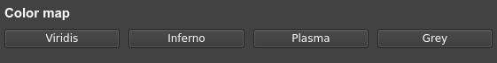
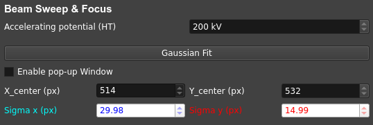

====================
Jungfrau GUI
====================

.. note::

    This page summarizes the main functionalities of the GUI. Each sections gives a brief overview of the avalable buttons/fileds and their functionality in each respective tab of the user interface.  

Below is a screenshot of the Image area (left) and the functionalities tabs (right):

.. image:: images/jf_gui.png
   :alt: Screenshot of the image area (left) and the Visualization Panel tab (right)
   :align: center

**Visualization Panel**
"""""""""""""""""""""""

A. Color map
------------

In this section, the user can define the colormap to map scalar data values to colors. Available options are:

- ``Viridis``
- ``Inferno``
- ``Plasma``
- ``Grey``

B. Streaming & Contrast
-----------------------

``View Stream``
   Intercepts and decodes the ZeroMQ stream of frames published by the Jungfraujoch receiver.

``Apply Auto Contrast``
   Dynamically adjusts the contrast of displayed frames. 
   
   .. tip:: 
    
        The algorthim retains values only between the 1st and the 99th percentile of the value range. One advantage is to throw out any non-physical outlier values such as overflows.

``Reset Contrast``
    Turn off the auto-contrast and reload preset contrast values from Redis. Four other presets can also be used.

    .. tip:: 
    
        Shortcut buttons are available to try different contrasts for a better visualization under different conditions

``Acquisition Interval (ms)``
   Defines the interval between each two displayed frames i.e. the frame rate.

C. Jungfraujoch Control Panel
-----------------------------

``Connect to Jungfraujoch``
    Establishes a connection with the Jungfraujoch back-end.

``Live stream``
    Displays summed frames.

    .. tip:: 
    
        A default setting of the GUI is to limit the live stream to 72000 frames at a time i.e. roughly 1h of data for a 20Hz frame rate. 
        The reason to have a limit is that Jungfraujoch (the data back-end) allocates buffers depending on the amount of frames it expects to collect. Setting a much larger number will make the start and stop slower. 

``Threshold``
    Defines the energy in keV below which values are cut.

    .. tip:: 
        In the Jungfraujch, thresholding is enabled when the entered value ``th`` is positive i.e. 

        - ``th = 0`` : Thresholding is disabled
        - ``th > 0`` : Pixel values below ``th`` are reset to zero.

``wait``
    If checked, this option freezes the GUI during data collection.

``Collect``
    Starts the recording of streamed frames.

``Cancel``
    Ends any ongoing measurement of the Junfraujoch (live streaming, data collection...)

``Record Full Pedestal``
    Records and subtracts the dark frames. Temporarily gets unresponsive to any controls (several seconds). Pedestal data is saved in the Jungfraujoch (not in GUI).
    
D. Detector
----------------

.. image:: images/jf_gui_visualization_panel_4.png
   :alt: Screenshot of the Detector section
   :width: 380px
   :align: center

``Magnification``, ``Distance``: 
    Read-only fields that respectively the magnification and the distance values (TEM mode only). 

``scale``
    Checkbox that displays the scale bar (1 um) or the ring (1 A).

**TEM Controls**
""""""""""""""""

A. Connection to TEM
------------------------

.. figure:: images/jf_gui_tem_controls_1.png
   :alt: Screenshot of the Connection to TEM section
   :width: 380px
   :align: center

``Check TEM Connection``
    Starts communication with TEM.

``Get TEM status``
    Displays the TEM status in the terminal.

    - ``recording`` : When checked, allows to save the TEM status in a .log file.

``Click-on-Centering``
    Activates stage control by clicking the image.

B. Beam Sweep & Focus
-------------------------

``Beam Autofocus``
    Sweeps IL1 and ILstig values.

    .. tip::
        Detail all the fields

C. Rotation & Stage Control
-------------------------------

``Rotation``
    Starts stage rotation to the target angle. The beam is unblanked during rotation and blanked when rotation ends.
    
    - ``with Writer``: Synchronizes the HDF writer with rotation.
    - ``JFJ``: Saves data in JFJ-server (NOETHER).
    - ``Auto reset``: Resets the tilt to 0 degrees after rotation.
    - ``Start angle``: Read-only field diplaying the current angle value (deg)
    - ``Target angle``: Editable fied to set end angle value (deg) of rotation.

``Rotation Speed``
    Adjusts rotation speed before starting the rotation. Also updates the rotation_speed_idx variable of the Configuration Manager in the data base.

``Stage Ctrl``
    Commands fast relative movements (±10 µm) and rotation (±10°) of the stage. 

``Mag Mode``
    Switches and displays (on the terminal) the current magnification mode.

    .. tip::
        In the PyJEM API, TEM modes are encoded as integers: 

        - **0=MAG**     : High magnification mode
        - **2=Low MAG** : Low magnification mode
        - **4=DIFF**    : Diffraction mode (Disables auto-contrast)

        More details on the PyJEM page: https://pyjem.github.io/PyJEM/interface/PyJEM.TEM3.html#PyJEM.TEM3.EOS3.SelectFunctionMode

``Positions``
    Dropdown menu to set the X-Y positions of the stage

    - ``Add``: Enquires about TEM stage position (through the API) and saves the coordinates in the dropdown menu
    - ``Go`` : Moves the TEM stage to the X-Y coordinates set in the ``Positions`` menu

**File Operations**
"""""""""""""""""""

.. warning::

    TIFF-Writer and HDF5-Writer have not been tested with JFJ. 

    - Please use the ``Collect`` push button in **Visualization Panel** instead.

A. Redis Store Settings
------------------------

.. image:: images/jf_gui_file_operations_1.png
   :alt: Screenshot of the Redis Store Settings section
   :width: 380px
   :align: center

``Experiment Class``
    Specifies for whom the data is collected (e.g., UniVie, External, IP).

``User Name*``
    Enter the PI (Person of Interest).

``Project ID*``
    Enter the project identifier.

``Base Data Directory``
    Specifies the root directory for data saving.

.. note::

    - All the fields marked with an asterisk (*) are manually editable. 
    - During edition, the entered values/text will be displayed in orange. 
    - Press [ENTER] to confirm modifications and values will be uploaded to the data base.

B. TIFF Writer
--------------

``Tiff File Name``
    Area to define the name of the TIFF file and its index. It contains:
    - First line-edit is read-only and displays the folder where TIFF files are saved.
    - Second line-edit is modifiable (ASCII characters and underscores only) and is meant for the file name.
    - Spinbox is modifiable, is incremented after each writing and represents the index of the written TIFF.

``index``
    Set the file index for the TIFF file.

``Accumulate in TIFF``
    Accumulates a specified number of frames in the TIFF file.

C. HDF5 Writer
--------------

.. image:: images/jf_gui_file_operations_3.png
   :alt: Screenshot of the HDF5 Writer section
   :width: 380px
   :align: center

``HDF5 Tag*``
    Enter the file prefix (ASCII characters and underscores only).

``index*``
    Set the file index for the HDF5 file.

``H5 Output Path``
    Read-only field showing the path where datasets are saved.
