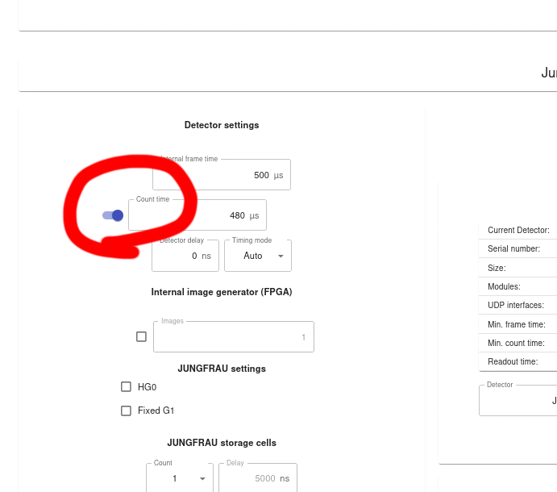

Troubleshooting
####################

Jungfraujoch
************

Negative values in image or halo around beam
============================================

If the image has negative values or a halo around the beam, it could be that 
the wrong pedestal was recorded in G1/G2. Make sure Count time is set to 480us
and activated.